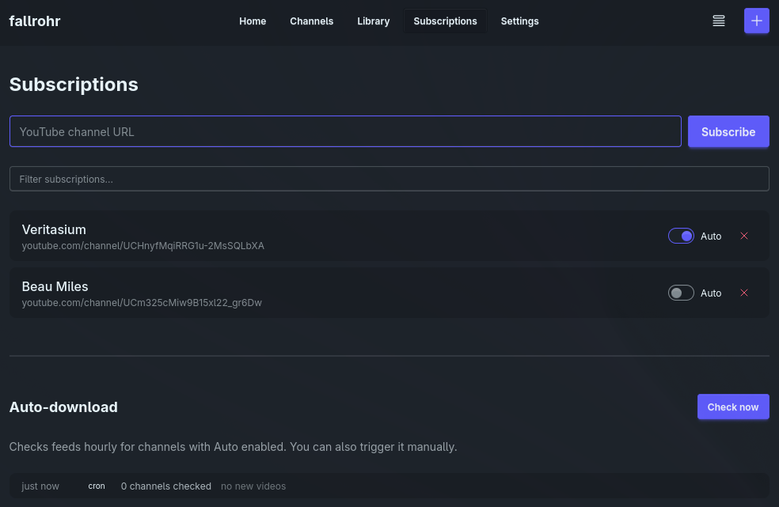
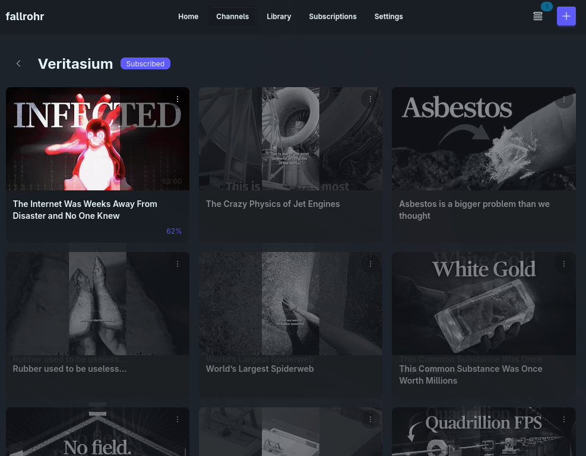

# Fallrohr

Track, download, consume and manage your favourite content creators (or anything else video related and supported by yt-dlp), ad-, algorithm- and trackingfree.

## Motivation

Fallrohr aims to solve the one issue I have with online video platforms: the algorithm attention grapping adinfested sinkhole they might become. Suddenly its 3am and you wonder how that time went by so fast. With fallrohr that is still possible, but at least its content you curated yourself.

The selfhosted community is awesome and the projects are exhaustive solving almost everything a home server owner would wish for. The idea of fallrohr is solved too actually (using [Jellyfin](https://jellyfin.org/) and [TubeSync](https://github.com/meeb/tubesync) for example), but I found it doing a bit too much or didnt understand it, most likely due to the lack of skill on my part.

Fallrohr under the hood is a web GUI for [yt-dlp](https://github.com/yt-dlp/yt-dlp) and [ffmpeg](https://ffmpeg.org/). There are several other implementations all packed with different approaches and features sets. This is my take on it.

## Installation

```sh
docker compose up -d
```

See [docker-compose.yml](docker-compose.yml) and [.env.example](.env.example) for all options.

## Configuration

### Environment variables

| Variable        | Description                              | Default       |
| --------------- | ---------------------------------------- | ------------- |
| `DATA_DIR`      | Directory for downloads and the database | `./downloads` |
| `PORT`          | Server port                              | `3000`        |
| `AUTH_USERNAME` | Username for basic auth (optional)       | —             |
| `AUTH_PASSWORD` | Password for basic auth (optional)       | —             |

Authentication is disabled unless both `AUTH_USERNAME` and `AUTH_PASSWORD` are set.

### In-app settings

These can be changed from the Settings page at runtime:

| Setting        | Description                                                          | Default |
| -------------- | -------------------------------------------------------------------- | ------- |
| Max resolution | Highest resolution to download                                       | 1080p   |
| Keep unwatched | Per auto-download channel, how many unwatched videos to keep locally | 5       |
| Keep watched   | Per auto-download channel, how many watched videos to keep locally   | 3       |

Older videos are cleaned up automatically when limits are exceeded.

## Features

- track YouTube channels through RSS feeds
- download new releases automatically
- download videos on demand
- add individual videos without the need to manage channels
- add non-YouTube links too, if supported by yt-dlp
- pick up watching where you left off
- enable the optional [SponsorBlock](https://sponsor.ajay.app/) integration
- optional authentication if you expose the service to the web
- PWA for mobile convenience

## Impressions/Screenshots




## Development

This project is created using AI (I suck at website design). PRs (also with AI) are welcome as long as you actually read, understood and tested what you want to ship.

### Run locally

```sh
npm install
npm run dev
```

### Tech Stack

- SvelteKit
- DaisyUI / Tailwind
- lowdb
- yt-dlp, ffmpeg, deno

## License

[MIT](LICENSE)
